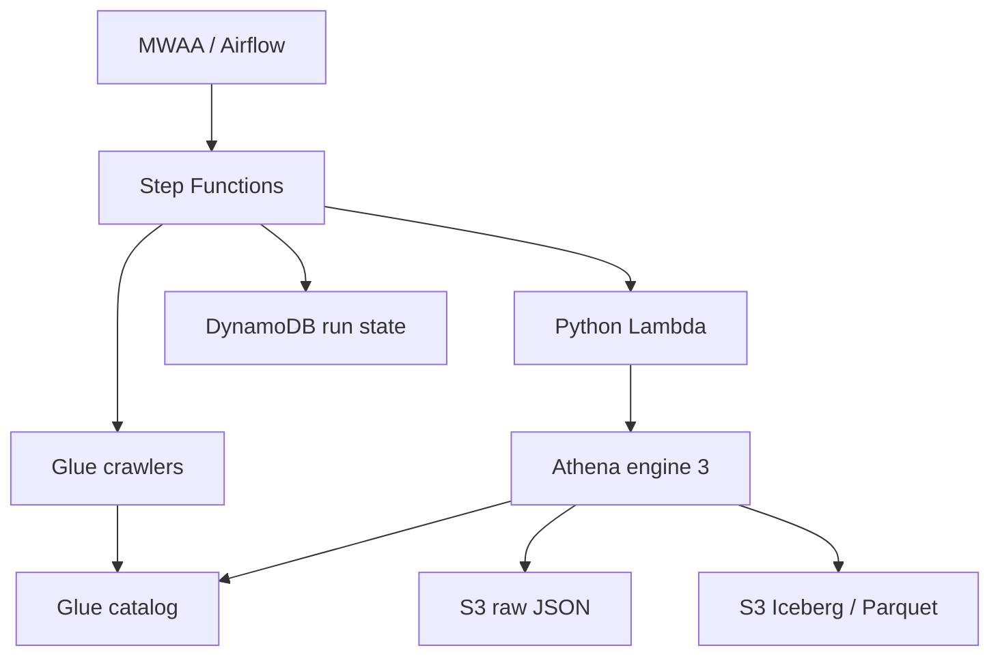

# AWS Event Analytics Lakehouse - Aurora Lakehouse

An AWS event analytics lakehouse with managed orchestration, durable Apache
Iceberg tables, and quality gates that prevent invalid data from being merged
into analytics marts.

Aurora turns newline-delimited event and user JSON into a queryable user
dimension and enriched event fact table. Airflow schedules the pipeline;
Step Functions owns execution state; Python Lambda functions submit SQL to
Athena engine 3. Glue catalogs the lake and DynamoDB stores run metadata.

## Sandbox execution results

In the project owner's sandbox evaluation, the pipeline processed **50 million
events and one million users in 25 minutes**.

| Metric | Before partition pruning | After partition pruning |
|---|---|---|
| One-day replay: raw event-source scan | Approximately 11.5 GB | Approximately 140 MB |
| One-day replay: end-to-end duration | 20 minutes | 14 minutes |

Replay duration decreased by **30%**, with historical validation still running.
Scan figures apply to the raw event source, not total pipeline scanning or cost.
These results describe the reported sandbox runs, not a throughput guarantee.

The attached regression report records **49 passing tests** covering runtime
behavior, quality gates, publication, partition pruning, and lock recovery.
See [execution summary](docs/evidence/sandbox-execution-summary.json) and
[regression output](docs/evidence/validation.json). Execution metrics were supplied
by the project owner; AWS region, resource sizing, execution ARNs, and query IDs
were not included in the supplied run summary.

## Architecture



Execution order: acquire lock → record start → crawl raw → create staging views
→ validate source → merge marts → crawl Iceberg → validate marts → publish validated snapshots → release lock → record
completion. Failed queries, failed crawlers, failed quality tests,
and failed audit writes cause a failed Step Functions execution.

## Features

- Daily 06:00 UTC scheduling with one active Airflow run and a shared execution lock.
- Two staging views, an ephemeral enrichment model, and Iceberg fact/dimension marts.
- Non-destructive upserts, fact partitioning by event date, Parquet and Snappy.
- **35 runtime quality checks** across source and marts: nulls, duplicate keys,
  relationships, event types, timestamp parsing, negative amounts, nonempty sources, and row-count reconciliation.
- Full scalar failure counts; query errors never become passing tests.
- Four bounded concurrent validation queries, deadlines, cancellation, and metrics.
- Elementary-shaped test history with explicit failure propagation.
- Deterministic generator configured for **50,000,000 events and 1,000,000 users**,
  bounded memory, file sharding, SHA-256 manifests, and nonoverlapping batch examples.
- Optional date-window fact merges and Hive-partitioned raw generation/pruning.
- Validated snapshot manifests with an atomic publication pointer and a pinned reader.
- Explicit stale-lock recovery that checks workflow state and all workgroup query states.
- dbt/runtime SELECT parity checks, repository completeness checks, and a local reference demo.
- Opt-in AWS replay/failure acceptance runner, execution-attributed benchmark metrics,
  and optional existing SNS alarm routing.
- Terraform modules, GitHub Actions checks, deployment CLI, benchmark exporter,
  operational runbooks, data contracts and database documentation.

## Technology stack

| Layer | Technologies |
|---|---|
| Languages | Python 3.11, SQL, Terraform HCL, YAML/JSON |
| Scheduling | Apache Airflow 2.10.3 on Amazon MWAA, Amazon provider |
| Workflow | AWS Step Functions Standard, AWS Lambda, boto3 |
| Transformations | dbt-athena-community, dbt SQL; deployed dbt-equivalent Athena SQL |
| dbt packages | dbt-utils, dbt-expectations, Elementary |
| Storage/catalog | S3, Apache Iceberg v2, Parquet/Snappy, Glue Data Catalog/crawlers |
| Queries/state | Athena engine 3, DynamoDB |
| Operations | CloudWatch, IAM, VPC/NAT, KMS |

The deployed runtime executes Python-managed SQL. It does **not** run dbt CLI
inside Lambda. The dbt project describes matching model logic and supports
local development. Elementary dependencies are retained; the runtime writes a
compatible-shaped result table, not a complete Elementary reporting platform.

## Quick start

```bash
python -m venv .venv
source .venv/bin/activate
pip install -r requirements.txt
python scripts/check_repository.py
python scripts/check_model_parity.py
python scripts/generate_test_report.py
python scripts/local_demo.py
terraform -chdir=terraform init
terraform -chdir=terraform plan -var-file=environments/sandbox/terraform.tfvars
```

Set a globally unique `project_name` in the sandbox tfvars before deployment.
Review the plan, then follow [deployment instructions](docs/deployment.md).
MWAA and NAT gateways incur standing charges even when pipelines are idle.

Small local fixture generation:

```bash
python data/generate_large_dataset.py --events 10000 --users 1000 --output .generated/smoke
```

After Terraform apply, upload and trigger:

```bash
python scripts/deploy.py --data sample_data --trigger
```

Large generation is opt-in by executing the following command; it creates many
GB of JSON and requires enough local disk:

```bash
python data/generate_large_dataset.py --events 50000000 --users 1000000 --output .generated/scale
```

## Local demo and compatible enhancements

The local demo needs only Python's standard library. From the extracted project:

```bash
python scripts/local_demo.py
```

Expected output: **24 events, 6 users, identical replay results**, and four
purchase events totaling **0.44**. This SQLite reference demo demonstrates data
semantics; it does not simulate Athena, IAM, Iceberg or Step Functions.

Existing workflow input `{}` still runs the full pipeline. Optional date-window
inputs, pinned published reads and an upgrade guide are described in
[compatible enhancements](docs/upgrade.md). Run a full baseline before windows.
The original dbt models, mart names/columns, raw NDJSON fields, Airflow schedule,
Terraform modules and Elementary-shaped audit schema are retained.

## Repository layout

```text
dags/                          Airflow scheduling and execution sensor
data/                          Deterministic generators and follow-on batches
dbt_project/models/staging/    Raw source views and contracts
dbt_project/models/intermediate/  Ephemeral event enrichment
dbt_project/models/marts/      Iceberg fact and dimension models
dbt_project/macros/            Shared Iceberg configuration
dbt_project/tests/             Additional SQL quality checks
terraform/modules/storage/    S3 storage policies
terraform/modules/catalog/    Glue database and crawlers
terraform/modules/metadata/   DynamoDB execution metadata
terraform/modules/analytics/  Athena workgroup and scan limits
terraform/modules/workflow/   Step Functions and Python Lambdas
terraform/modules/orchestration/  MWAA, networking, Airflow configuration
docs/                          Architecture, operations, contracts and deployment
sample_data/                   Tiny synthetic NDJSON fixture and manifest
scripts/                       Deployment, validation and benchmark tools
tests/                         Offline runtime and generator regressions
.github/workflows/             Automated validation
```

## Documentation

- [Architecture and design decisions](docs/architecture.md)
- [Database, data contracts and invocation API](docs/database-api.md)
- [Deployment and dbt development](docs/deployment.md)
- [Operations and recovery](docs/runbooks.md)
- [50-million-event benchmark](docs/benchmark.md)
- [Enhancements and production gaps](docs/enhancements.md)
- [Validation evidence](docs/validation.md)
- [Upgrade, publication, windows and GitHub upload](docs/upgrade.md)
- [Security and operational practices](docs/best-practices.md)
- [Contributing](CONTRIBUTING.md)

## Boundaries

The ingest contract is append-only, unique-key raw data. Full-source merges
remain the default and handle late arrivals without a watermark. Optional
windows require explicit replay for older arrivals; raw pruning requires the
new partitioned layout. Global mart checks still scan retained history.
Multi-table publication is consistent only for readers using the snapshot
manifest; direct legacy table reads may observe partial updates. Deletes, CDC,
evolving schemas and complete Elementary UI integration remain outside scope. Profile updates must replace the user snapshot
at its existing object paths; overlapping snapshots fail duplicate tests.

Source/mart email columns contain personal data; use synthetic data for public
demos. Production promotion requires the AWS acceptance and recovery checks
listed in the documentation.

## Publish to GitHub

Upload the **complete extracted folder**, including `.github`, rather than only
its top-level files. The current public repository was missing the source
folders; `scripts/check_repository.py --tracked` catches this before a commit.
See [existing repository update instructions](docs/upgrade.md).

The source is ready for a new repository in your GitHub account. After reviewing
the code, configure your Git identity and run these commands from the project
folder (GitHub CLI must be authenticated):

```bash
git init -b main
git add --all
python scripts/check_repository.py --tracked
git commit -m "Initial Aurora Lakehouse implementation"
gh repo create aurora-lakehouse --public --source=. --remote=origin --push
```

Suggested description: AWS event analytics lakehouse with Airflow, Step Functions,
Athena, Iceberg, dbt and quality-gated batch pipelines. Suggested topics:
data-engineering, aws, airflow, dbt, athena, apache-iceberg, terraform, lakehouse.

License: [MIT](LICENSE).
